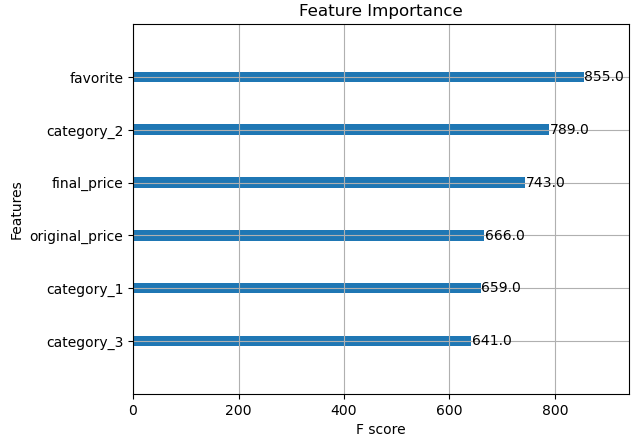

# Sales Prediction using XGBoost on Shopee Sales Data

## Overview
This project focuses on predicting whether a product will sell well on Shopee, Southeast Asia's leading e-commerce platform. By leveraging the Shopee Sales Dataset from Kaggle, the project applies data preprocessing, feature engineering, and machine learning using XGBoost to classify products based on their likelihood of high sales performance.

## Purpose
The primary goal of this project is to:
1. Predict product sales performance using product-specific features and historical data.
2. Identify key features influencing sales, providing actionable insights for sellers.
3. Showcase the use of XGBoost for binary classification tasks in e-commerce datasets.

## Dataset
- **Source:** Shopee Sales Dataset (Kaggle)
- **Rows:** 20,000

## Key Highlights
### Data Cleaning and Feature Engineering
1. Cleaned and transformed **20,000 rows** using Pandas and NumPy:
   - Converted price columns to local currency (PHP).
   - Extracted hierarchical product categories and separated into three column (`category_1`, `category_2`, `category_3`).
   - Standardized numerical features and handled missing data.
   - Added columns like `sell_well` for binary classification and `product_origin` for region-based analysis.

2. **Feature Importance Analysis:**
   - Using XGBoost's feature importance plot, the `favorite` column was identified as the most influential predictor, followed by `category_2`, `final_price`, and `original_price`. These insights indicate customer engagement and pricing are key factors in sales performance.

   

### Machine Learning Workflow
1. **Model:** XGBoost Classifier for binary classification (`sell_well` as the target).
2. **Performance:** Achieved **88% accuracy** in predicting product sales performance on the test dataset.
3. **Feature Selection:** Used `favorite`, `original_price`, `final_price`, `category_1`, `category_2`, and `category_3` as predictors, enabling targeted insights for sellers.

### Tools and Technologies
- **Programming Language:** Python
- **Libraries:** Pandas, NumPy, Scikit-learn, XGBoost, Matplotlib
- **Data Preprocessing:** Cleaned and structured the data using Pandas and NumPy.
- **Feature Engineering:** Created custom features for hierarchical product categorization and sales thresholds.
- **Model Training:** XGBoost optimized with evaluation metrics like log loss.
- **Visualization:** Generated feature importance plots using Matplotlib.

